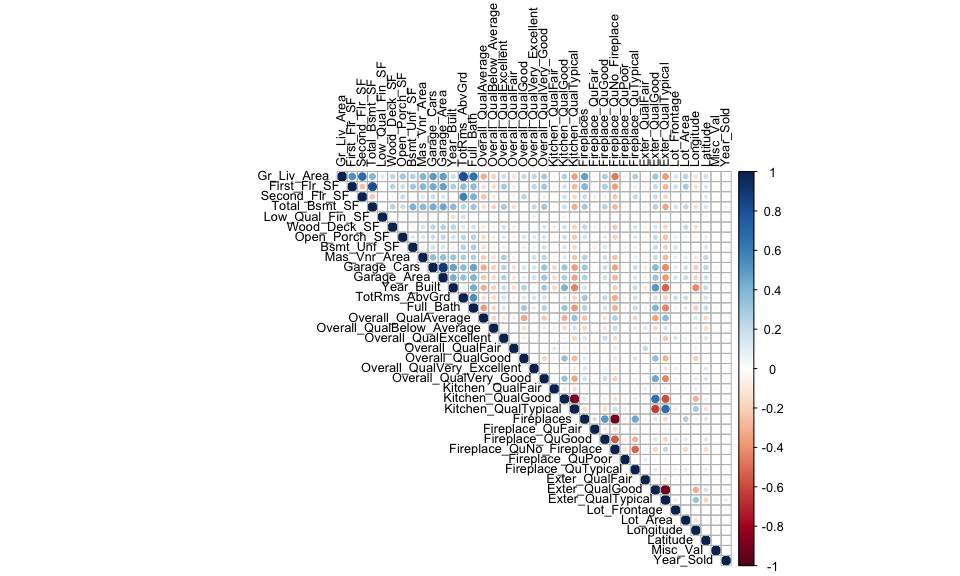

p8106\_hw1\_qw2331
================

### Data Overview

``` r
trainHousing <- read_csv("./data/housing_training.csv")
testHousing <- read_csv("./data/housing_test.csv")

# A brief overview of train data
dfSummary(trainHousing)
```

    ## ### Data Frame Summary  
    ## **trainHousing**   
    ## **Dimensions:** 1440 x 26  
    ## **Duplicates:** 0  
    ## 
    ## ----------------------------------------------------------------------------------------------------------------------------------------------
    ## No   Variable           Stats / Values                    Freqs (% of Valid)     Graph                                    Valid      Missing  
    ## ---- ------------------ --------------------------------- ---------------------- ---------------------------------------- ---------- ---------
    ## 1    Gr_Liv_Area\       Mean (sd) : 1477.6 (484.9)\       838 distinct values    \ \ \ \ :\                               1440\      0\       
    ##      [numeric]          min < med < max:\                                        \ \ \ \ : :\                             (100.0%)   (0.0%)   
    ##                         492 < 1432.5 < 4316\                                     \ \ \ \ : :\                                                 
    ##                         IQR (CV) : 628.2 (0.3)                                   \ \ : : :\                                                   
    ##                                                                                  \ \ : : : : .                                                
    ## 
    ## 2    First_Flr_SF\      Mean (sd) : 1134.2 (367.9)\       744 distinct values    \ \ : :\                                 1440\      0\       
    ##      [numeric]          min < med < max:\                                        \ \ : :\                                 (100.0%)   (0.0%)   
    ##                         372 < 1055 < 3228\                                       \ \ : : :\                                                   
    ##                         IQR (CV) : 475.8 (0.3)                                   \ \ : : : :\                                                 
    ##                                                                                  . : : : : .                                                  
    ## 
    ## 3    Second_Flr_SF\     Mean (sd) : 338.6 (422.8)\        402 distinct values    :\                                       1440\      0\       
    ##      [numeric]          min < med < max:\                                        :\                                       (100.0%)   (0.0%)   
    ##                         0 < 0 < 1872\                                            :\                                                           
    ##                         IQR (CV) : 704.8 (1.2)                                   :\                                                           
    ##                                                                                  : \ \ . : : . .                                              
    ## 
    ## 4    Total_Bsmt_SF\     Mean (sd) : 1035.1 (413.8)\       695 distinct values    \ \ \ \ :\                               1440\      0\       
    ##      [numeric]          min < med < max:\                                        \ \ \ \ : .\                             (100.0%)   (0.0%)   
    ##                         0 < 975 < 3206\                                          \ \ \ \ : :\                                                 
    ##                         IQR (CV) : 469.8 (0.4)                                   \ \ \ \ : : :\                                               
    ##                                                                                  . : : : : :                                                  
    ## 
    ## 5    Low_Qual_Fin_SF\   Mean (sd) : 4.7 (44.3)\           20 distinct values     :\                                       1440\      0\       
    ##      [numeric]          min < med < max:\                                        :\                                       (100.0%)   (0.0%)   
    ##                         0 < 0 < 697\                                             :\                                                           
    ##                         IQR (CV) : 0 (9.5)                                       :\                                                           
    ##                                                                                  :                                                            
    ## 
    ## 6    Wood_Deck_SF\      Mean (sd) : 98.4 (133.8)\         290 distinct values    :\                                       1440\      0\       
    ##      [numeric]          min < med < max:\                                        :\                                       (100.0%)   (0.0%)   
    ##                         0 < 0 < 1424\                                            :\                                                           
    ##                         IQR (CV) : 169 (1.4)                                     : .\                                                         
    ##                                                                                  : : .                                                        
    ## 
    ## 7    Open_Porch_SF\     Mean (sd) : 45.1 (63.5)\          187 distinct values    :\                                       1440\      0\       
    ##      [numeric]          min < med < max:\                                        :\                                       (100.0%)   (0.0%)   
    ##                         0 < 26 < 570\                                            :\                                                           
    ##                         IQR (CV) : 68 (1.4)                                      :\                                                           
    ##                                                                                  : : .                                                        
    ## 
    ## 8    Bsmt_Unf_SF\       Mean (sd) : 520.6 (415)\          778 distinct values    :\                                       1440\      0\       
    ##      [numeric]          min < med < max:\                                        : :\                                     (100.0%)   (0.0%)   
    ##                         0 < 431.5 < 2336\                                        : : : .\                                                     
    ##                         IQR (CV) : 574.5 (0.8)                                   : : : :\                                                     
    ##                                                                                  : : : : : . .                                                
    ## 
    ## 9    Mas_Vnr_Area\      Mean (sd) : 95.4 (168)\           295 distinct values    :\                                       1440\      0\       
    ##      [numeric]          min < med < max:\                                        :\                                       (100.0%)   (0.0%)   
    ##                         0 < 0 < 1600\                                            :\                                                           
    ##                         IQR (CV) : 149.2 (1.8)                                   :\                                                           
    ##                                                                                  : : .                                                        
    ## 
    ## 10   Garage_Cars\       Mean (sd) : 1.8 (0.7)\            0 :  61 ( 4.2%)\       \                                        1440\      0\       
    ##      [numeric]          min < med < max:\                 1 : 393 (27.3%)\       IIIII \                                  (100.0%)   (0.0%)   
    ##                         0 < 2 < 5\                        2 : 820 (56.9%)\       IIIIIIIIIII \                                                
    ##                         IQR (CV) : 1 (0.4)                3 : 158 (11.0%)\       II \                                                         
    ##                                                           4 :   7 ( 0.5%)\       \                                                            
    ##                                                           5 :   1 ( 0.1%)                                                                     
    ## 
    ## 11   Garage_Area\       Mean (sd) : 471.9 (201.6)\        442 distinct values    \ \ \ \ \ \ :\                           1440\      0\       
    ##      [numeric]          min < med < max:\                                        \ \ \ \ \ \ :\                           (100.0%)   (0.0%)   
    ##                         0 < 480 < 1356\                                          \ \ \ \ : : .\                                               
    ##                         IQR (CV) : 240 (0.4)                                     \ \ . : : :\                                                 
    ##                                                                                  . : : : : : .                                                
    ## 
    ## 12   Year_Built\        Mean (sd) : 1970.2 (29.4)\        107 distinct values    \ \ \ \ \ \ \ \ \ \ \ \ \ \ \ \ \ \ :\   1440\      0\       
    ##      [numeric]          min < med < max:\                                        \ \ \ \ \ \ \ \ \ \ \ \ \ \ \ \ \ \ :\   (100.0%)   (0.0%)   
    ##                         1872 < 1972 < 2009\                                      \ \ \ \ \ \ \ \ \ \ \ \ : : \ \ :\                           
    ##                         IQR (CV) : 44 (0)                                        \ \ \ \ \ \ . \ \ . : : : :\                                 
    ##                                                                                  \ \ \ \ . : : : : : : :                                      
    ## 
    ## 13   TotRms_AbvGrd\     Mean (sd) : 6.4 (1.5)\            3 :  17 ( 1.2%)\       \                                        1440\      0\       
    ##      [numeric]          min < med < max:\                 4 : 102 ( 7.1%)\       I \                                      (100.0%)   (0.0%)   
    ##                         3 < 6 < 12\                       5 : 309 (21.5%)\       IIII \                                                       
    ##                         IQR (CV) : 2 (0.2)                6 : 413 (28.7%)\       IIIII \                                                      
    ##                                                           7 : 321 (22.3%)\       IIII \                                                       
    ##                                                           8 : 158 (11.0%)\       II \                                                         
    ##                                                           9 :  62 ( 4.3%)\       \                                                            
    ##                                                           10 :  39 ( 2.7%)\      \                                                            
    ##                                                           11 :  11 ( 0.8%)\      \                                                            
    ##                                                           12 :   8 ( 0.6%)                                                                    
    ## 
    ## 14   Full_Bath\         Mean (sd) : 1.5 (0.5)\            0 :   3 ( 0.2%)\       \                                        1440\      0\       
    ##      [numeric]          min < med < max:\                 1 : 683 (47.4%)\       IIIIIIIII \                              (100.0%)   (0.0%)   
    ##                         0 < 2 < 4\                        2 : 728 (50.6%)\       IIIIIIIIII \                                                 
    ##                         IQR (CV) : 1 (0.4)                3 :  25 ( 1.7%)\       \                                                            
    ##                                                           4 :   1 ( 0.1%)                                                                     
    ## 
    ## 15   Overall_Qual\      1\. Above_Average\                382 (26.5%)\           IIIII \                                  1440\      0\       
    ##      [character]        2\. Average\                      425 (29.5%)\           IIIII \                                  (100.0%)   (0.0%)   
    ##                         3\. Below_Average\                104 ( 7.2%)\           I \                                                          
    ##                         4\. Excellent\                    42 ( 2.9%)\            \                                                            
    ##                         5\. Fair\                         22 ( 1.5%)\            \                                                            
    ##                         6\. Good\                         302 (21.0%)\           IIII \                                                       
    ##                         7\. Very_Excellent\               13 ( 0.9%)\            \                                                            
    ##                         8\. Very_Good                     150 (10.4%)            II                                                           
    ## 
    ## 16   Kitchen_Qual\      1\. Excellent\                    72 ( 5.0%)\            I \                                      1440\      0\       
    ##      [character]        2\. Fair\                         24 ( 1.7%)\            \                                        (100.0%)   (0.0%)   
    ##                         3\. Good\                         559 (38.8%)\           IIIIIII \                                                    
    ##                         4\. Typical                       785 (54.5%)            IIIIIIIIII                                                   
    ## 
    ## 17   Fireplaces\        Mean (sd) : 0.6 (0.7)\            0 : 705 (49.0%)\       IIIIIIIII \                              1440\      0\       
    ##      [numeric]          min < med < max:\                 1 : 616 (42.8%)\       IIIIIIII \                               (100.0%)   (0.0%)   
    ##                         0 < 1 < 3\                        2 : 113 ( 7.8%)\       I \                                                          
    ##                         IQR (CV) : 1 (1.1)                3 :   6 ( 0.4%)                                                                     
    ## 
    ## 18   Fireplace_Qu\      1\. Excellent\                    17 ( 1.2%)\            \                                        1440\      0\       
    ##      [character]        2\. Fair\                         41 ( 2.8%)\            \                                        (100.0%)   (0.0%)   
    ##                         3\. Good\                         344 (23.9%)\           IIII \                                                       
    ##                         4\. No_Fireplace\                 705 (49.0%)\           IIIIIIIII \                                                  
    ##                         5\. Poor\                         25 ( 1.7%)\            \                                                            
    ##                         6\. Typical                       308 (21.4%)            IIII                                                         
    ## 
    ## 19   Exter_Qual\        1\. Excellent\                    39 ( 2.7%)\            \                                        1440\      0\       
    ##      [character]        2\. Fair\                         15 ( 1.0%)\            \                                        (100.0%)   (0.0%)   
    ##                         3\. Good\                         469 (32.6%)\           IIIIII \                                                     
    ##                         4\. Typical                       917 (63.7%)            IIIIIIIIIIII                                                 
    ## 
    ## 20   Lot_Frontage\      Mean (sd) : 55 (32.5)\            105 distinct values    \ \ \ \ \ \ :\                           1440\      0\       
    ##      [numeric]          min < med < max:\                                        \ \ \ \ : :\                             (100.0%)   (0.0%)   
    ##                         0 < 60 < 174\                                            : \ \ : :\                                                   
    ##                         IQR (CV) : 39 (0.6)                                      : \ \ : : :\                                                 
    ##                                                                                  : : : : : .                                                  
    ## 
    ## 21   Lot_Area\          Mean (sd) : 10101 (8302.1)\       1063 distinct values   :\                                       1440\      0\       
    ##      [numeric]          min < med < max:\                                        :\                                       (100.0%)   (0.0%)   
    ##                         1470 < 9306.5 < 164660\                                  :\                                                           
    ##                         IQR (CV) : 4187 (0.8)                                    :\                                                           
    ##                                                                                  :                                                            
    ## 
    ## 22   Longitude\         Mean (sd) : -93.6 (0)\            1411 distinct values   \ \ \ \ \ \ \ \ : . .\                   1440\      0\       
    ##      [numeric]          min < med < max:\                                        : \ \ \ \ . : : : :\                     (100.0%)   (0.0%)   
    ##                         -93.7 < -93.6 < -93.6\                                   : . \ \ : : : : :\                                           
    ##                         IQR (CV) : 0 (0)                                         : : : : : : : :\                                             
    ##                                                                                  : : : : : : : :                                              
    ## 
    ## 23   Latitude\          Mean (sd) : 42 (0)\               1400 distinct values   \ \ \ \ \ \ \ \ . \ \ :\                 1440\      0\       
    ##      [numeric]          min < med < max:\                                        \ \ \ \ \ \ \ \ : : : \ \ . .\           (100.0%)   (0.0%)   
    ##                         42 < 42 < 42.1\                                          \ \ \ \ \ \ \ \ : : : : : :\                                 
    ##                         IQR (CV) : 0 (0)                                         . \ \ \ \ . : : : : : :\                                     
    ##                                                                                  : : \ \ : : : : : : :                                        
    ## 
    ## 24   Misc_Val\          Mean (sd) : 54.4 (590.4)\         26 distinct values     :\                                       1440\      0\       
    ##      [numeric]          min < med < max:\                                        :\                                       (100.0%)   (0.0%)   
    ##                         0 < 0 < 15500\                                           :\                                                           
    ##                         IQR (CV) : 0 (10.8)                                      :\                                                           
    ##                                                                                  :                                                            
    ## 
    ## 25   Year_Sold\         Mean (sd) : 2007.9 (1.3)\         2006 : 259 (18.0%)\    III \                                    1440\      0\       
    ##      [numeric]          min < med < max:\                 2007 : 339 (23.5%)\    IIII \                                   (100.0%)   (0.0%)   
    ##                         2006 < 2008 < 2010\               2008 : 323 (22.4%)\    IIII \                                                       
    ##                         IQR (CV) : 2 (0)                  2009 : 347 (24.1%)\    IIII \                                                       
    ##                                                           2010 : 172 (11.9%)     II                                                           
    ## 
    ## 26   Sale_Price\        Mean (sd) : 177568.5 (73659.4)\   599 distinct values    \ \ :\                                   1440\      0\       
    ##      [numeric]          min < med < max:\                                        \ \ :\                                   (100.0%)   (0.0%)   
    ##                         52000 < 159000 < 755000\                                 \ \ :\                                                       
    ##                         IQR (CV) : 77000 (0.4)                                   . : :\                                                       
    ##                                                                                  : : : .                                                      
    ## ----------------------------------------------------------------------------------------------------------------------------------------------

From the summary, there are `25` predictors with `1` response
`Sale_Price` in the train data and each column has `1440` observations
without missing values. And there are `4` categorical predictors so
additional transformations are needed as they are difficult to interpret
and potentially causing other problems.

### Data Preprocessing

``` r
# Convert categorical into dummy variables
train_x <- model.matrix(Sale_Price ~ ., trainHousing)[ ,-1]
train_y <- trainHousing$Sale_Price
test_x <- model.matrix(Sale_Price ~ ., testHousing)[ ,-1]
test_y <- testHousing$Sale_Price

corrplot(cor(train_x), 
         type = "upper", tl.cex = .8, tl.col = "black")
```



### Least Squares

``` r
ctrl <- trainControl(method = "repeatedcv", number = 10, repeats = 5)

set.seed(1234)
lm.fit <- train(train_x, train_y,
                method = "lm",
                trControl = ctrl)

summary(lm.fit)
```

    ## 
    ## Call:
    ## lm(formula = .outcome ~ ., data = dat)
    ## 
    ## Residuals:
    ##    Min     1Q Median     3Q    Max 
    ## -89864 -12424    416  12143 140205 
    ## 
    ## Coefficients: (1 not defined because of singularities)
    ##                              Estimate Std. Error t value Pr(>|t|)    
    ## (Intercept)                -4.985e+06  3.035e+06  -1.642  0.10076    
    ## Gr_Liv_Area                 2.458e+01  1.393e+01   1.765  0.07778 .  
    ## First_Flr_SF                4.252e+01  1.409e+01   3.017  0.00260 ** 
    ## Second_Flr_SF               4.177e+01  1.379e+01   3.029  0.00250 ** 
    ## Total_Bsmt_SF               3.519e+01  2.744e+00  12.827  < 2e-16 ***
    ## Low_Qual_Fin_SF                    NA         NA      NA       NA    
    ## Wood_Deck_SF                1.202e+01  4.861e+00   2.474  0.01350 *  
    ## Open_Porch_SF               1.618e+01  1.004e+01   1.611  0.10736    
    ## Bsmt_Unf_SF                -2.087e+01  1.723e+00 -12.116  < 2e-16 ***
    ## Mas_Vnr_Area                1.046e+01  4.229e+00   2.473  0.01353 *  
    ## Garage_Cars                 4.229e+03  1.893e+03   2.234  0.02563 *  
    ## Garage_Area                 7.769e+00  6.497e+00   1.196  0.23195    
    ## Year_Built                  3.251e+02  3.130e+01  10.388  < 2e-16 ***
    ## TotRms_AbvGrd              -3.838e+03  6.922e+02  -5.545 3.51e-08 ***
    ## Full_Bath                  -4.341e+03  1.655e+03  -2.622  0.00883 ** 
    ## Overall_QualAverage        -5.013e+03  1.735e+03  -2.890  0.00391 ** 
    ## Overall_QualBelow_Average  -1.280e+04  2.677e+03  -4.782 1.92e-06 ***
    ## Overall_QualExcellent       7.261e+04  5.381e+03  13.494  < 2e-16 ***
    ## Overall_QualFair           -1.115e+04  5.240e+03  -2.127  0.03356 *  
    ## Overall_QualGood            1.226e+04  1.950e+03   6.287 4.30e-10 ***
    ## Overall_QualVery_Excellent  1.304e+05  8.803e+03  14.810  < 2e-16 ***
    ## Overall_QualVery_Good       3.798e+04  2.741e+03  13.852  < 2e-16 ***
    ## Kitchen_QualFair           -2.663e+04  6.325e+03  -4.210 2.71e-05 ***
    ## Kitchen_QualGood           -1.879e+04  4.100e+03  -4.582 5.01e-06 ***
    ## Kitchen_QualTypical        -2.677e+04  4.281e+03  -6.252 5.37e-10 ***
    ## Fireplaces                  1.138e+04  2.257e+03   5.043 5.18e-07 ***
    ## Fireplace_QuFair           -7.207e+03  6.823e+03  -1.056  0.29106    
    ## Fireplace_QuGood            6.070e+02  5.833e+03   0.104  0.91713    
    ## Fireplace_QuNo_Fireplace    3.394e+03  6.298e+03   0.539  0.59002    
    ## Fireplace_QuPoor           -5.185e+03  7.399e+03  -0.701  0.48362    
    ## Fireplace_QuTypical        -6.398e+03  5.897e+03  -1.085  0.27814    
    ## Exter_QualFair             -3.854e+04  8.383e+03  -4.598 4.66e-06 ***
    ## Exter_QualGood             -1.994e+04  5.585e+03  -3.569  0.00037 ***
    ## Exter_QualTypical          -2.436e+04  5.874e+03  -4.147 3.57e-05 ***
    ## Lot_Frontage                1.024e+02  1.905e+01   5.376 8.90e-08 ***
    ## Lot_Area                    6.042e-01  7.864e-02   7.683 2.91e-14 ***
    ## Longitude                  -3.481e+04  2.537e+04  -1.372  0.17016    
    ## Latitude                    5.874e+04  3.483e+04   1.686  0.09193 .  
    ## Misc_Val                    9.171e-01  1.003e+00   0.914  0.36071    
    ## Year_Sold                  -6.455e+02  4.606e+02  -1.401  0.16132    
    ## ---
    ## Signif. codes:  0 '***' 0.001 '**' 0.01 '*' 0.05 '.' 0.1 ' ' 1
    ## 
    ## Residual standard error: 22190 on 1401 degrees of freedom
    ## Multiple R-squared:  0.9116, Adjusted R-squared:  0.9092 
    ## F-statistic: 380.3 on 38 and 1401 DF,  p-value: < 2.2e-16

Based on both the correlation plot and the modeling result, the
disadvantage of using least squares to fit a linear model in this case
is that there are some collinear covariates. When two predictor
variables are highly correlated, the variance of the estimated function
will increase and lead to a higher MSE and lower prediction accuracy.

### Lasso
