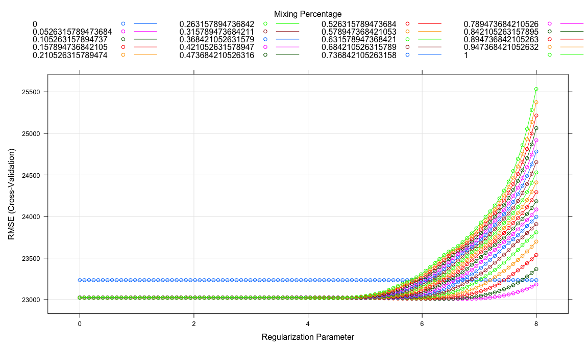

p8106\_hw1\_qw2331
================

### Data Overview

``` r
# Import data
trainHousing <- read_csv("./data/housing_training.csv")
testHousing <- read_csv("./data/housing_test.csv")

# For each column in train data
# Check missing values
sum(colSums(is.na(trainHousing)))

# Check outliers
trainHousing[, -c(15, 16, 18, 19, 26)] %>% # Exclude character & response columns
  pivot_longer(
    everything(),
    names_to = "Variable",
    values_to = "Value"
  ) %>%
  ggplot(aes(x = Variable, y = Value)) + 
  geom_boxplot(aes(color = Variable), show.legend = FALSE) + 
  facet_wrap(~ Variable, scales = "free", nrow = 3, ncol = 7) + 
  theme(axis.text.x = element_blank())
```


-   In general, there are `25` predictors and `1440` observations
    `without` missing values.  
-   The response of the data is `Sale_Price`.  
-   There are `4` categorical predictors so additional transformations
    are needed as they are difficult to interpret in the result and will
    potentially cause other problems.

### Data Preprocessing

``` r
# Convert categorical into dummy variables
train_x <- model.matrix(Sale_Price ~ ., trainHousing)[ ,-1]
train_y <- trainHousing$Sale_Price
test_x <- model.matrix(Sale_Price ~ ., testHousing)[ ,-1]
test_y <- testHousing$Sale_Price

# Correlation plot
corrplot(cor(train_x), 
         type = "full", tl.cex = .7, tl.col = "black")
```


### Least Squares

``` r
set.seed(1234)

lm_fit <- train(train_x, train_y,
                method = "lm",
                trControl = trainControl(method = "cv", number = 10))

# Coefficients of 39 predictors
lm_fit$finalModel$coefficients[-1]
```

    ##                Gr_Liv_Area               First_Flr_SF 
    ##                  24.580013                  42.524807 
    ##              Second_Flr_SF              Total_Bsmt_SF 
    ##                  41.767625                  35.191950 
    ##            Low_Qual_Fin_SF               Wood_Deck_SF 
    ##                         NA                  12.024295 
    ##              Open_Porch_SF                Bsmt_Unf_SF 
    ##                  16.177799                 -20.869718 
    ##               Mas_Vnr_Area                Garage_Cars 
    ##                  10.458006                4228.629576 
    ##                Garage_Area                 Year_Built 
    ##                   7.769075                 325.118788 
    ##              TotRms_AbvGrd                  Full_Bath 
    ##               -3838.100643               -4340.544104 
    ##        Overall_QualAverage  Overall_QualBelow_Average 
    ##               -5013.000215              -12799.206345 
    ##      Overall_QualExcellent           Overall_QualFair 
    ##               72606.089958              -11146.857536 
    ##           Overall_QualGood Overall_QualVery_Excellent 
    ##               12263.080342              130377.046730 
    ##      Overall_QualVery_Good           Kitchen_QualFair 
    ##               37975.180534              -26628.516431 
    ##           Kitchen_QualGood        Kitchen_QualTypical 
    ##              -18786.749812              -26765.115583 
    ##                 Fireplaces           Fireplace_QuFair 
    ##               11380.833066               -7206.509633 
    ##           Fireplace_QuGood   Fireplace_QuNo_Fireplace 
    ##                 606.991938                3394.266867 
    ##           Fireplace_QuPoor        Fireplace_QuTypical 
    ##               -5184.596707               -6397.856038 
    ##             Exter_QualFair             Exter_QualGood 
    ##              -38540.876203              -19936.203490 
    ##          Exter_QualTypical               Lot_Frontage 
    ##              -24361.041343                 102.402170 
    ##                   Lot_Area                  Longitude 
    ##                   0.604167              -34813.221408 
    ##                   Latitude                   Misc_Val 
    ##               58744.294511                   0.917129 
    ##                  Year_Sold 
    ##                -645.465513

-   **Disadvantage of using least squares:**
    -   One drawback is that there are some collinear covariates. When
        two predictor variables are highly correlated, the variance of
        the estimated function will increase and thus a higher MSE and
        lower prediction accuracy.  
    -   The other one is that least-squares method is highly sensitive
        to outliers as it simply minimizes the redisuals of each data
        point.

### Lasso

``` r
set.seed(1234)

cv_lasso <- cv.glmnet(train_x, train_y,
                      alpha = 1,
                      lambda = exp(seq(11, 3, length = 100)))

par(mfrow = c(1, 2))
plot(cv_lasso)
plot_glmnet(cv_lasso$glmnet.fit)
```


``` r
# Number of predictors when using lambda.1se
predict(cv_lasso, s = "lambda.1se", type = "coefficients")
```

    ## 40 x 1 sparse Matrix of class "dgCMatrix"
    ##                                 lambda.1se
    ## (Intercept)                -2224118.562333
    ## Gr_Liv_Area                      56.598618
    ## First_Flr_SF                      1.126315
    ## Second_Flr_SF                     .       
    ## Total_Bsmt_SF                    36.750704
    ## Low_Qual_Fin_SF                 -26.061451
    ## Wood_Deck_SF                      8.305179
    ## Open_Porch_SF                     7.878145
    ## Bsmt_Unf_SF                     -19.455680
    ## Mas_Vnr_Area                     14.259477
    ## Garage_Cars                    3071.512417
    ## Garage_Area                      11.340938
    ## Year_Built                      313.826712
    ## TotRms_AbvGrd                 -1223.941524
    ## Full_Bath                         .       
    ## Overall_QualAverage           -3060.240960
    ## Overall_QualBelow_Average     -9072.750593
    ## Overall_QualExcellent         90236.692623
    ## Overall_QualFair              -6225.790608
    ## Overall_QualGood               9829.696034
    ## Overall_QualVery_Excellent   160116.730523
    ## Overall_QualVery_Good         36113.221679
    ## Kitchen_QualFair              -5186.950779
    ## Kitchen_QualGood                  .       
    ## Kitchen_QualTypical           -9676.460765
    ## Fireplaces                     6462.742412
    ## Fireplace_QuFair                  .       
    ## Fireplace_QuGood               4727.745942
    ## Fireplace_QuNo_Fireplace          .       
    ## Fireplace_QuPoor                  .       
    ## Fireplace_QuTypical               .       
    ## Exter_QualFair               -14430.295128
    ## Exter_QualGood                    .       
    ## Exter_QualTypical             -5099.588982
    ## Lot_Frontage                     70.020122
    ## Lot_Area                          0.558723
    ## Longitude                    -10294.516873
    ## Latitude                      16348.622605
    ## Misc_Val                          .       
    ## Year_Sold                         .

``` r
# Calculate the test error
lasso_rmse <- 
  RMSE(pred = predict(cv_lasso, newx = test_x, 
                      s = "lambda.min", type = "response"), obs = test_y)

# --- Use caret ---
set.seed(1234)

lasso_fit <- train(train_x, train_y,
                   method = "glmnet",
                   tuneGrid = expand.grid(alpha = 1,
                                          lambda = exp(seq(11, 3, length = 100))),
                   trControl = trainControl(method = "cv", selectionFunction = "oneSE"))
```

-   **Results:** The test error of the lasso regression is `21032.65`.
    When the 1SE rule is applied, there are `29` predictors included in
    the model.

### Elastic net

``` r
set.seed(1234)

enet_fit <- train(train_x, train_y,
                  method = "glmnet",
                  tuneGrid = expand.grid(alpha = seq(0, 1, length = 20),
                                         lambda = exp(seq(8, 0, length = 100))),
                  trControl = trainControl(method = "cv", number = 10))

plot(enet_fit, xTrans = log)
```



``` r
enet_fit$bestTune
```

    ##          alpha   lambda
    ## 183 0.05263158 754.6565

### Partial least squares (PLS)
